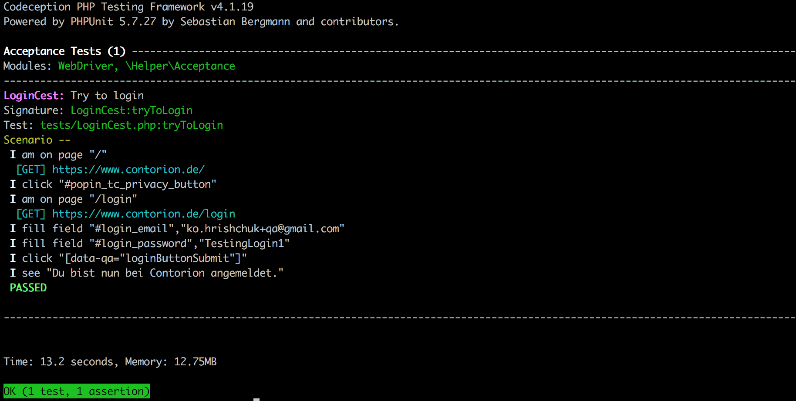

# Automated Test for Contorion 

## Description

## Positive Test scenario 1: Login into Contorion website

> Validate if the user logs in successfully if the credentials entered are correct

## Getting started

### Clone the repository

```bash
git clone https://github.com/korneliia/auto-test-contorion.git
cd auto-test-contorion
```

### Install dependencies

```bash
php composer.phar install
```

If you have problems with installing packages, check this issue: [install ext-zip for Mac](https://stackoverflow.com/questions/58290566/install-ext-zip-for-mac)

### Start the Selenium Server

```bash
java -jar selenium-server-standalone-3.141.59.jar
```

### Run automated tests locally

From the project root execute:

```bash
./vendor/bin/codecept run --debug
```

or

```bash
php vendor/bin/codecept run --debug
```

### Successful test run



### Technologies used

- Composer - a Dependency Manager for PHP
- Selenium WebDriver
- Chrome driver
- [Codeception](https://codeception.com/) and PHP